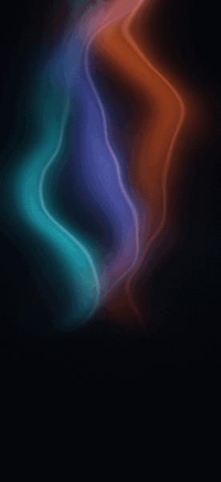

# 光学暗房

> 让音乐像曝光一样，在暗色胶片上留下持续变化的光痕。

  

## 音轨如何参与画面

| 声音 | 画面表现 | 保留方式 |
| --- | --- | --- |
| 吉他 | 推动三道青蓝、紫色与琥珀色光膜流动 | 光带随旋律连续变化 |
| 钢琴 | 在不同位置显出冷色光斑 | 每个音符独立扩散、淡出，并留下轻微曝光痕迹 |
| 鼓点 | 触发暖色局部曝光 | 光斑缓慢扩散和消散，不被后续鼓点重置 |
| DSP | 逐渐增加胶片显影与细颗粒 | 随播放进度累积 |

效果使用 Metal 着色器，在方形逻辑画布中渲染，并按 30 FPS 运行。动图为合成音轨参数生成的视觉示意，实际颜色和响应由播放时的音频分析驱动。

## 实现位置

- 着色器：[`OpticalDarkroomShader.metal`](../AudioSampleBuffer/VisualEffects/Metal/OpticalDarkroomShader.metal)
- 渲染器：[`MetalRenderer.m`](../AudioSampleBuffer/VisualEffects/Metal/MetalRenderer.m)
- 效果选择器缩略图：[`EffectSelectorView.m`](../AudioSampleBuffer/VisualEffects/UI/EffectSelectorView.m)
