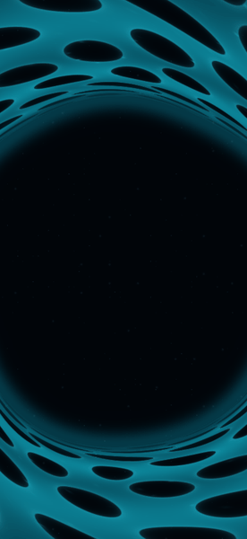
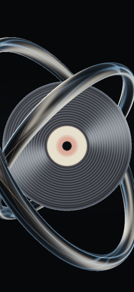
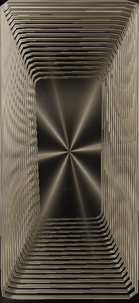

# 动态特效画廊

AudioSampleBuffer 包含多种音乐可视化风格。下面展示四种辨识度较高的 Metal 特效；动图中的光学暗房来自合成音轨输入，另外三组由对应着色器在不同音频状态下渲染，再用短暂渐变连接。真机播放时，画面会由实时音频分析持续驱动。

## 深空蜂巢

蜂巢状空间膜包围深空核心，低频鼓点带来冲击，旋律与吉他能量改变空间结构。

  

## 玻璃回旋

金属玻璃环绕唱片旋转，频段能量改变折射、光束和色散，高能段加强整体光感。

  

## 镜层回廊

层叠镜面形成纵深通道，低、中、高频分别影响镜层、光束与结构变化。

  

## 光学暗房

吉他推动青蓝、紫色与琥珀色光膜；钢琴音符和鼓点各自留下光斑及曝光痕迹。

  

[查看光学暗房的音轨响应说明](OPTICAL_DARKROOM.md)

## 项目内已注册的效果

### 频谱与几何

经典频谱、环形波浪、3D波形、音频响应3D、几何变形、分形图案、霓虹弹簧竖线、封面点阵、声音活动表、音乐特征镜、视觉歌词。

### 光线与未来感

霓虹发光、全息效果、赛博朋克、闪电、光绘焦散、极光波纹、丁达尔光束、棱镜共振、玻璃回旋、镜层回廊。

### 空间与宇宙

星系、量子场、恒星涡旋、虫洞穿梭、神经共振、深空蜂巢。

### 流体与粒子

粒子流、流体模拟、漂浮光点、液态金属、液态颜料、樱花飘雪、光学暗房。

特效选择器会展示当前工程可用的效果。不同效果的音频映射和画面细节以对应渲染器实现为准。
